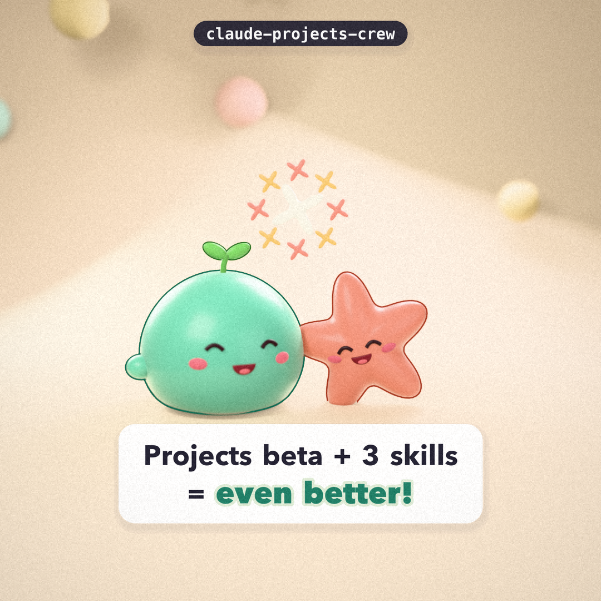

# claude-projects-crew

```bash
REPO=207studio/claude-projects-crew   # the only place the repository name is written; change it here
```

Three Claude Code skills for people who run work through **Projects (beta)** in
the Claude desktop app's Code tab (also at claude.ai/code and in the mobile app):
one coordinator conversation that starts parallel **threads**, each usually a
cloud session on its own branch that opens its own pull request.

The skills do not change the app. They add repository-side habits that make the
gaps between threads, sessions and machines smaller, and they say plainly which
gaps they only soften.

[한국어 안내는 아래에 있습니다](#한국어)



Why these skills exist, and what we would like the app itself to change:
[docs/proposal.md](docs/proposal.md) (Korean, with an English summary).

## Problems and what each skill does

| # | Problem (from real use) | Skill | Solves or mitigates |
|---|---|---|---|
| 1 | Project conversations live on claude.ai, not on your disk | `project-handoff` | **Mitigates.** State, decisions and next steps are committed to the repo, so `git pull` brings them to your machine. Transcripts themselves stay on claude.ai. |
| 2 | Computer use has to be switched on / approved again per conversation | `portable-env` (step 3) | **Mitigates.** Lists tasks that need your computer, so the coordinator can send them to a thread on your machine and you prepare once. The skill cannot switch computer use on. |
| 3 | Work stops at the session (usage) limit | `project-handoff` | **Mitigates.** Checkpoint notes and WIP commits, so a resumed or new session continues from a written next step. It cannot see or raise your limit. |
| 4 | Local skills, instructions, MCP and hooks do not follow into cloud sessions; local↔cloud moves files and branches, not a live link | `portable-env`, `project-handoff` | **Solves for** skills, subagents, commands and `CLAUDE.md` (copied into the repo's `.claude/`). **Partly** for hooks and `.mcp.json` (single-repository sessions only). **Not** for plugins (set in Project settings). State moves through git, not in real time. |
| 5 | Each thread PRs only its own part; nobody reviews how the parts fit, and a worker's "done" is taken at its word | `integration-review` | **Solves the check, not the merge.** Cross-checks a branch against the base and every other open branch (overlaps, predicted conflicts, drift, shared config, dangling references) and re-measures a worker's claims (e.g. "under 280 characters") against the actual files. |

## The skills

| Skill | Role | Script |
|---|---|---|
| `project-handoff` | Read project state at session start; write and commit a handoff note at milestones, before stopping, or near a limit | `scripts/handoff.py init \| read [--all-branches] \| write ... [--commit] [--push]` |
| `portable-env` | Show what in `~/.claude` will not reach the cloud, copy the portable parts into the repo, flag non-portable paths, list local-only tasks | `scripts/env_audit.py [--copy-skill NAME] [--strict]` |
| `integration-review` | Before a PR is opened or merged: cross-branch check + out-of-scope checklist; after a worker reports: verify its claims | `scripts/crosscheck.py`, `scripts/verify_claims.py` |

Repository files the skills create or read: `HANDOFF.md` (shared state) and
`handoff/sessions/*.md` (one append-only file per branch and session, so
parallel threads never edit the same note).

## Install

**For cloud sessions and Projects threads (recommended):** commit the skills to
a repository that is part of the project. Cloud threads clone the project's
repositories and load `.claude/skills/` from each of them.

```bash
git clone "https://github.com/$REPO" /tmp/crew
/tmp/crew/scripts/install.sh --repo /path/to/your/project-repo
cd /path/to/your/project-repo && git add .claude/skills && git commit -m "Add crew skills"
```

**For this machine only:** `~/.claude/skills` works in local sessions but is
not available in cloud sessions.

```bash
/tmp/crew/scripts/install.sh --user
```

**As a plugin (local sessions):** the repository is also a plugin marketplace.

```bash
claude plugin marketplace add "$REPO"
claude plugin install claude-projects-crew@claude-projects-crew
```

Plugin skills are namespaced, e.g. `/claude-projects-crew:integration-review`.
Cloud sessions do not install plugins from your local settings or from a
repository's `enabledPlugins`; for Projects threads add plugins in
**Project settings > Plugins**, or use the repository install above.

Requirements: git (2.38+ for conflict prediction), python3 3.8+, bash. No other
dependencies. `gh` is optional (PR titles in `crosscheck.py --gh`).

## Usage examples

```text
/project-handoff            # at the start of a thread: read state, pick an open item
"checkpoint and hand off"   # writes handoff/sessions/..., commits the note
/portable-env               # on your machine: what won't reach the cloud?
/integration-review         # before opening or merging the PR
```

Put a line like this in the project instructions so every thread follows it:

```text
Start every thread with the project-handoff skill. Before opening a PR, run the
integration-review skill and include its "Integration notes" in the PR body.
When you delegate, require a claims block and verify it with verify_claims.py.
```

## Limitations (read before relying on it)

- Skills are instructions. Claude decides when to use them from the description,
  and it can skip them. Project instructions that name the skill help.
- Nothing here changes the app: transcripts stay on claude.ai, computer use is
  still enabled in the desktop app and approved per app per session, and usage
  limits are unchanged. From the docs: a Projects thread that hits the limit
  waits and continues after the reset; a thread started by a routine stops.
- A session cannot read its remaining usage, so "limit near" is a judgment call.
  Checkpoint at milestones instead of waiting for the end.
- `crosscheck.py` sees only branches that were pushed and fetched, in one
  repository. It predicts textual conflicts; it does not run your tests on the
  merged result.
- `verify_claims.py` checks only claims that were written down in the claims
  block. A worker that reports no claims is marked UNVERIFIED, not failed.
  `x_weighted` approximates X/Twitter's counter; confirm on the platform.
- In a Projects project with several repositories, hooks, permission rules and
  `.mcp.json` from `.claude/settings.json` do not apply to threads, so this
  repository does not rely on hooks.
- Projects is a beta; the behavior cited here comes from the documentation in
  September 2026 and may change.

## Development

```bash
tests/run_tests.sh          # builds throwaway git repos and exercises every script
python3 tests/validate_skills.py
claude plugin validate .
```

## Sources

- Projects: https://code.claude.com/docs/en/claude-projects
- What carries over to cloud sessions: https://code.claude.com/docs/en/cloud-environments
- Skills: https://code.claude.com/docs/en/skills and https://agentskills.io/specification
- Plugins and marketplaces: https://code.claude.com/docs/en/plugins, https://code.claude.com/docs/en/plugins/create-marketplace
- Subagents: https://code.claude.com/docs/en/sub-agents
- Code Review and `/code-review`: https://code.claude.com/docs/en/code-review
- Computer use: https://code.claude.com/docs/en/computer-use, https://code.claude.com/docs/en/desktop

## License

MIT — see [LICENSE](LICENSE).

---

## 한국어

Claude 데스크톱 앱 Code 탭의 **Projects(베타)** — 조율자 대화 하나가 여러
**스레드**(대개 각자 브랜치에서 PR을 여는 클라우드 세션)를 돌리는 기능 — 를
쓰는 사람을 위한 Claude Code 스킬 세 개입니다. 앱 자체를 고치지 않고, 저장소
쪽 습관으로 스레드·세션·기기 사이의 빈틈을 줄입니다. 완화만 되는 것은 완화라고
적었습니다.

| # | 문제 | 스킬 | 해결/완화 |
|---|---|---|---|
| 1 | 프로젝트 대화가 로컬이 아니라 클라우드(claude.ai)에만 있다 | `project-handoff` | **완화**: 상태·결정·다음 단계를 저장소에 커밋 → `git pull`로 내 컴퓨터에 남음. 대화 원문은 여전히 claude.ai에 있음 |
| 2 | 대화마다 컴퓨터 사용을 다시 켜야 한다 | `portable-env` 3단계 | **완화**: 내 컴퓨터가 필요한 작업을 문서로 모아 한 번에 준비하고 로컬 스레드로 보냄. 스킬이 컴퓨터 사용을 켜 주지는 못함 |
| 3 | 작업 중 세션(사용량) 한도에 걸려 멈춘다 | `project-handoff` | **완화**: 중간 체크포인트·WIP 커밋으로 재개 지점을 남김. 남은 사용량을 보거나 늘리지는 못함 |
| 4 | 로컬 스킬·지침·MCP·훅이 클라우드로 안 넘어가고, 로컬↔클라우드는 실시간 연결이 아니다 | `portable-env`, `project-handoff` | 스킬·서브에이전트·명령·`CLAUDE.md`는 **해결**(저장소 `.claude/`로 이동), 훅·`.mcp.json`은 **부분**(저장소 1개일 때만), 플러그인은 **불가**(Project settings에서 추가). 상태는 git으로 전달, 실시간 아님 |
| 5 | 스레드마다 자기 몫만 PR하고 통합 검토가 없으며, 하위 에이전트 보고를 그대로 믿는다 | `integration-review` | **검사는 해결, 병합은 사람 몫**: 다른 열린 브랜치와 겹침·충돌 예측·main 변화·공유 설정·끊긴 참조를 점검하고, "280자 이내" 같은 보고를 실제 파일로 다시 잰다 |

설치: 프로젝트에 포함된 저장소에 `scripts/install.sh --repo <저장소>`로 복사하고
커밋하면 클라우드 스레드에서도 작동합니다. `--user`(`~/.claude/skills`)는 이
컴퓨터의 로컬 세션에서만 작동합니다. 플러그인 설치는 위 영어 섹션 참고.

한계: 스킬은 지시문이라 Claude가 건너뛸 수 있고(프로젝트 지침에 스킬 이름을
적으면 도움이 됨), 앱 동작(대화 저장 위치·컴퓨터 사용 승인·사용량 한도)은 바꾸지
못합니다. `crosscheck.py`는 push된 브랜치만 보고 테스트를 대신하지 않으며,
`verify_claims.py`는 적힌 주장만 검사합니다. Projects는 베타이므로 문서 내용이
바뀔 수 있습니다.
